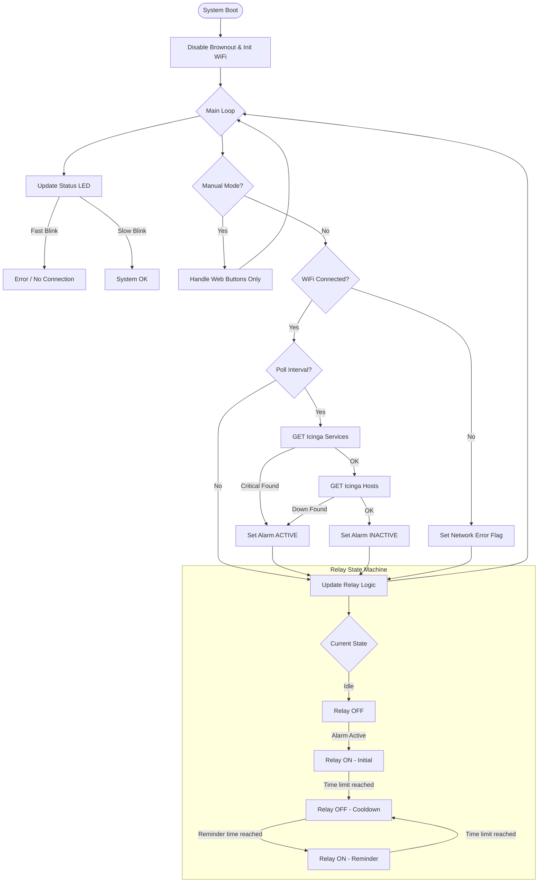

# Icinga-lighthouse 🚨
**A robust, industrial-grade ESP32 monitor for Icinga2, running on LilyGO T-Relay.**

icinga-lighthouse turns a LilyGO T-Relay board into a physical alarm system for your infrastructure. It monitors both Services (Critical) and Hosts (Down) via the Icinga2 API. If an issue is detected, it triggers a physical siren/light (Relay 1) with a smart reminder logic.
-----

## 🌟 Key Features

  * **Dual Monitoring:** Checks specific API endpoints for *Critical Services* AND *Down Hosts*.
  * **Smart Alarm Logic:**
    1.  **Initial Alarm:** Continuous siren for a set time (e.g., 30s).
    2.  **Cooldown:** Silence to preserve sanity.
    3.  **Reminder:** Short bursts (e.g., 15s) every few minutes if the issue persists.
  * **Safe Mode Architecture:**
      * **No Bootloops:** Connection failures do not crash the device.
      * **Brownout Protection:** Disabled brownout detector to handle power spikes from relays.
      * **Heap JSON:** Uses dynamic memory allocation to prevent stack overflows.
  * **Web Configuration Panel:** Fully configurable via a responsive Web UI (WiFi, URLs, Timings, Language).
  * **Multi-language:** Dictionary-based support for **English** and **Polish**.
  * **Manual Test Mode:** Physical buttons in Web UI to toggle relays manually (pauses automation for 60s).

-----

## 🛠️ Hardware & Pinout

**Device:** LilyGO T-Relay (4-Channel ESP32)

| Component | GPIO Pin | Description |
| :--- | :--- | :--- |
| **Relay 1** | **GPIO 21** | **Main Alarm (Siren/Light)** |
| Relay 2 | GPIO 19 | *Disabled / Spare* |
| Relay 3 | GPIO 18 | *Disabled / Spare* |
| Relay 4 | GPIO 05 | *Disabled / Spare* |
| **Status LED** | **GPIO 25** | System Heartbeat / Error Indicator |

### 🔌 Wiring the Siren

Connect your visual/audio signaling device to **Relay 1**:

1.  Connect Power Source (+) to **COM** (Common).
2.  Connect Siren (+) to **NO** (Normally Open).
3.  *The siren will only activate when the alarm is triggered.*

-----

## 🧠 Application Logic (Mermaid Diagram)

This flowchart illustrates the core loop of the `icinga-lighthouse` firmware.

-----

## 🚦 Status Indicators

The onboard LED (GPIO 25) indicates the current health of the monitor:

  * **🟢 Slow Blink (1s):** System OK. Connected to WiFi and Icinga API reachable.
  * **🔴 Fast Blink (0.2s):** Error. WiFi disconnected OR Icinga API unreachable (check IP/Port).

-----

## ⚙️ Configuration Guide

1.  Connect the device to power.
2.  If not configured, connect to WiFi AP: `icinga-lighthouse-cfg` (Pass: `admin123`).
3.  Open `http://192.168.4.1` (or the assigned IP if connected to your router).
4.  Login (Default: `admin` / `admin`).

### API Setup

You need two URLs from your Icinga API (Port 5665).

  * **Services URL:** Endpoint to check for CRITICAL services.
      * *Example:* `https://192.168.1.100:5665/v1/objects/services?filter=service.state==2`
  * **Hosts URL:** Endpoint to check for DOWN hosts.
      * *Example:* `https://192.168.1.100:5665/v1/objects/hosts?filter=host.state!=0`

### Timings

  * **Poll Interval:** How often to query the API (Recommended: 5s - 10s).
  * **Alarm Duration:** How long the siren screams initially (e.g., 30s).
  * **Reminder Interval:** How often to remind if the error persists (e.g., every 5 min).
  * **Reminder Duration:** How long the reminder scream lasts (e.g., 15s).

-----

## 📦 Installation (Flashing)

1.  Install **Arduino IDE**.
2.  Install **ESP32 Board Manager** (Expressif).
3.  Install Libraries:
      * `ArduinoJson`
4.  Select Board: **ESP32 Dev Module** (or ESP32 Wrover Module).
5.  **IMPORTANT:** Since this project uses `WRITE_PERI_REG`, ensure you are using a compatible ESP32 Core version (v3.0+ is supported in the code).
6.  Upload `icinga-lighthouse.ino`.

-----

## 📝 License

[https://github.com/dzaczek/icinga-lighthouse](https://github.com/dzaczek/icinga-lighthouse)
