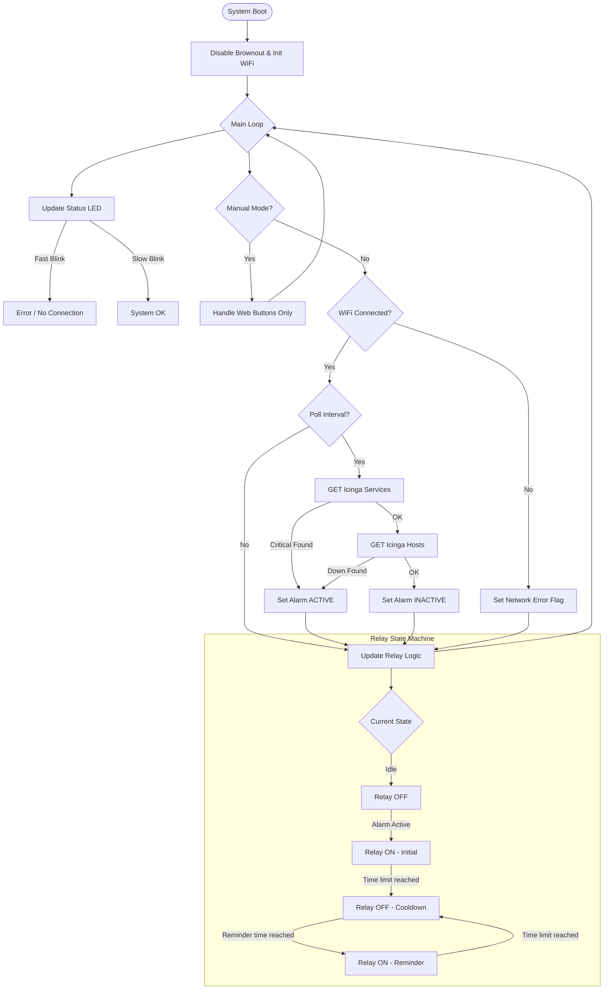

# Icinga-lighthouse 🚨
**A robust, industrial-grade ESP32 monitor for Icinga2, running on LilyGO T-Relay.**


icinga-lighthouse turns a LilyGO T-Relay board into a physical alarm system for your infrastructure. It monitors both Services (Critical) and Hosts (Down) through the **Icinga DB Web JSON API** (Icinga *Web*, not the Icinga 2 core API) — so acknowledged, in-downtime and flapping problems are filtered out server-side and never trip the siren. A problem must also be confirmed over several consecutive polls before the siren (Relay 1) fires, with a smart reminder logic afterwards.
-----

## 🌟 Key Features

  * **Dual Monitoring:** Checks the Icinga DB Web API for *Critical Services* AND *Down Hosts*.
  * **Noise-free by design:** Server-side filters (`is_acknowledged=n`, `in_downtime=n`, `is_flapping=n`) mean acknowledged / muted / flapping problems are ignored.
  * **Confirmation threshold:** A problem must be seen *N* polls in a row (default **3**, configurable) before the siren fires — debounces transient/false positives. While confirming, the device polls at a faster "recheck" cadence instead of waiting a full interval.
  * **Business hours:** Optionally mute the siren outside a working-hours window (e.g. 06:00–18:00, Mon–Fri). Alerts are still shown; only the relay is silenced. Clock from Icinga's HTTP `Date` header (no NTP).
  * **Smart Alarm Logic:**
    1.  **Initial Alarm:** Continuous siren for a set time (e.g., 30s).
    2.  **Cooldown:** Silence to preserve sanity.
    3.  **Reminder:** Short bursts (e.g., 15s) every few minutes if the issue persists.
  * **Safe Mode Architecture:**
      * **No Bootloops:** Connection failures do not crash the device.
      * **Brownout Protection:** Disabled brownout detector to handle power spikes from relays.
      * **Heap JSON:** Uses dynamic memory allocation to prevent stack overflows.
  * **Ethernet (W5500) with WiFi fallback:** Auto-detects the LilyGo T-Relay W5500 shield (H671); if present it is used automatically, otherwise the device falls back to WiFi. Selectable in the panel (Auto / Disabled).
  * **Web Configuration Panel:** Fully configurable via a responsive Web UI (WiFi, Ethernet, URLs, Timings, Language).
  * **Multi-language:** Dictionary-based support for **English** and **Polish**.
  * **Manual Test Mode:** Physical buttons in Web UI to toggle relays manually (pauses automation for 60s).

-----

## UX


## 🛠️ Hardware & Pinout

**Device:** LilyGO T-Relay (4-Channel ESP32)

| Component | GPIO Pin | Description |
| :--- | :--- | :--- |
| **Relay 1** | **GPIO 21** | **Main Alarm (Siren/Light)** |
| Relay 2 | GPIO 19 | *Disabled / Spare* |
| Relay 3 | GPIO 18 | *Disabled / Spare* |
| Relay 4 | GPIO 05 | *Disabled / Spare* |
| **Status LED** | **GPIO 25** | System Heartbeat / Error Indicator |

### 🔌 Wiring the Siren

Connect your visual/audio signaling device to **Relay 1**:

1.  Connect Power Source (+) to **COM** (Common).
2.  Connect Siren (+) to **NO** (Normally Open).
3.  *The siren will only activate when the alarm is triggered.*

### 🌐 Ethernet — LilyGo T-Relay W5500 Shield (H671)

Plug in the W5500 shield and the device uses wired Ethernet automatically
(DHCP), falling back to WiFi if the shield is absent or the cable is unplugged.
It can be forced off in the panel (Ethernet mode → *Disabled*). Pinout (T-Relay-4):

| W5500 | GPIO | | W5500 | GPIO |
| :--- | :--- | :--- | :--- | :--- |
| SCLK | 22 | | CS | 27 |
| MISO | 13 | | RST | 23 |
| MOSI | 26 | | INT | 36 |

> These pins do not collide with the relays (21/19/18/5) or status LED (25).
> Uses the WIZnet **Ethernet** Arduino library (the ESP32 core 2.x built-in
> `ETH` has no SPI/W5500 support). icingadb-web is queried over plain HTTP on
> the Ethernet path.

-----

## 🧠 Application Logic (Mermaid Diagram)

This flowchart illustrates the core loop of the `icinga-lighthouse` firmware.


```mermaid
graph TD
    Start([System Boot]) --> Init[Disable Brownout & Init WiFi]
    Init --> Loop{Main Loop}

    %% Status LED Logic
    Loop --> LED[Update Status LED]
    LED -- Fast Blink --> ErrState[Error / No Connection]
    LED -- Slow Blink --> OKState[System OK]

    %% Manual Override Check
    Loop --> ManCheck{Manual Mode?}
    ManCheck -- Yes --> WebCtrl[Handle Web Buttons Only]
    WebCtrl --> Loop

    %% Automatic Logic
    ManCheck -- No --> WiFiCheck{WiFi Connected?}
    
    WiFiCheck -- No --> SetErr[Set Network Error Flag]
    WiFiCheck -- Yes --> PollTime{Poll Interval?}
    
    PollTime -- No --> Logic
    PollTime -- Yes --> CheckSvc[GET Icinga Services]
    
    CheckSvc -- Critical Found --> AlarmSet[Set Alarm ACTIVE]
    CheckSvc -- OK --> CheckHost[GET Icinga Hosts]
    
    CheckHost -- Down Found --> AlarmSet
    CheckHost -- OK --> AlarmClear[Set Alarm INACTIVE]
    
    %% Relay Logic Machine
    AlarmSet --> Logic
    AlarmClear --> Logic
    SetErr --> Logic
    
    subgraph Relay State Machine
    Logic[Update Relay Logic] --> StateCheck{Current State}
    StateCheck -- Idle --> R_Idle[Relay OFF]
    R_Idle -- Alarm Active --> R_Init[Relay ON - Initial]
    R_Init -- Time limit reached --> R_Cool[Relay OFF - Cooldown]
    R_Cool -- Reminder time reached --> R_Rem[Relay ON - Reminder]
    R_Rem -- Time limit reached --> R_Cool
    end
    
    Logic --> Loop
```

-----

## 🚦 Status Indicators

The onboard LED (GPIO 25) indicates the current health of the monitor:

  * **🟢 Slow Blink (1s):** System OK. Connected to WiFi and Icinga API reachable.
  * **🔴 Fast Blink (0.2s):** Error. WiFi disconnected OR Icinga API unreachable (check IP/Port).

-----

## ⚙️ Configuration Guide

1.  Connect the device to power.
2.  If not configured, connect to WiFi AP: `icinga-lighthouse-cfg` (Pass: `admin123`).
3.  Open `http://192.168.4.1` (or the assigned IP if connected to your router).
4.  Login (Default: `admin` / `admin`).

### API Setup

The device talks to **Icinga Web 2 / Icinga DB Web** (default port 8080), using HTTP Basic auth with an Icinga Web login. `http://` and `https://` are both supported (https uses an insecure/no-verify TLS connection). `limit=1` keeps the response tiny — the device only needs to know whether *any* unhandled problem exists.

  * **Services URL:** unhandled CRITICAL services.
      * *Example:* `http://192.168.1.100:8080/icingadb/services?service.state.soft_state=2&service.state.is_acknowledged=n&service.state.in_downtime=n&service.state.is_flapping=n&limit=1`
  * **Hosts URL:** unhandled DOWN hosts.
      * *Example:* `http://192.168.1.100:8080/icingadb/hosts?host.state.soft_state=1&host.state.is_acknowledged=n&host.state.in_downtime=n&host.state.is_flapping=n&limit=1`
  * **Web User / Pass:** an Icinga Web 2 login (e.g. `admin` / `admin` in the test-env).

> Note: Icinga DB Web is served at the web root (`/icingadb/...`), not under `/icingaweb2/...`, on the official container image.

### Timings & Logic

  * **Poll Interval:** normal query cadence (e.g. 30s).
  * **Fast recheck on problem:** while a fresh problem is being confirmed, poll this fast instead (e.g. 10s).
  * **Confirm threshold:** consecutive problem polls required before the siren fires (default 3).
  * **Alarm Duration:** how long the siren screams initially (e.g., 30s).
  * **Reminder Interval:** how often to remind if the error persists (e.g., every 5 min).
  * **Reminder Duration:** how long the reminder scream lasts (e.g., 15s).

### Business Hours (siren mute window)

The siren can be restricted to a working-hours window — e.g. **06:00–18:00, Mon–Fri**.
Alerts are still *detected and shown* in the UI outside the window; only the relay is
kept silent. The device clock comes from the **HTTP `Date` header** of Icinga's replies
(works over WiFi and Ethernet alike — no NTP). Settings: enable on/off, start hour,
end hour (exclusive), Mon–Fri vs every day, and a UTC offset for your local time.

-----

## 🚀 Deployment

The firmware is a single Arduino sketch (`trelaylaatern.ino`) for the ESP32. Flash it
with **PlatformIO** (CLI, scriptable) or the **Arduino IDE**. Libraries: `ArduinoJson`
(always) and `Ethernet` / WIZnet (only for the W5500 shield).

### Option A — PlatformIO CLI (macOS / Linux / Windows)

```bash
# 1) Install PlatformIO Core
#    macOS:  brew install platformio        (or: pipx install platformio)
#    Linux:  pipx install platformio        (or: pip install --user platformio)

# 2) Create a project that points at this sketch
mkdir -p build/src && cp trelaylaatern.ino build/src/main.ino
cat > build/platformio.ini <<'INI'
[env:esp32dev]
platform = espressif32
board = esp32dev
framework = arduino
monitor_speed = 115200
upload_speed = 115200          ; some USB-serial bridges fail at 921600
lib_deps =
  bblanchon/ArduinoJson@^6.21.3
  arduino-libraries/Ethernet@^2.0.2
INI

# 3) Find the serial port
#    macOS:  ls /dev/tty.usbserial-*   or  /dev/tty.SLAB_USBtoUART
#    Linux:  ls /dev/ttyUSB*           (add yourself to the 'dialout' group)

# 4) Build, flash, watch the log
cd build
pio run                                              # compile
pio run -t upload --upload-port /dev/tty.usbserial-XXXX
pio device monitor -b 115200 -p /dev/tty.usbserial-XXXX
```

> Tip: a fresh board boots into a WiFi access point `icinga-lighthouse-cfg`
> (password `admin123`); open `http://192.168.4.1` to configure it. To start from
> known defaults instead, wipe stored settings first: `pio run -t erase`.

### Option B — Arduino IDE (macOS / Linux / Windows)

1. Install the **ESP32 board package** (Boards Manager → "esp32" by Espressif).
2. Install libraries (Library Manager): **ArduinoJson**, and **Ethernet** (WIZnet) for the shield.
3. Board: **ESP32 Dev Module**. Port: your USB-serial device.
4. Open `trelaylaatern.ino` and click **Upload**.

### Option C — flash a prebuilt binary with esptool (any OS)

```bash
pip install esptool
esptool.py --port /dev/tty.usbserial-XXXX --baud 115200 write_flash 0x10000 firmware.bin
```

### First-run configuration

1. Connect to the AP `icinga-lighthouse-cfg` (or reach the device IP if it already has
   Ethernet/WiFi) and open the web panel (default login `admin` / `admin`).
2. Set WiFi (or just plug in the W5500 shield for auto Ethernet), the Icinga DB Web URLs
   + login, timings, confirm threshold, and business hours. Save → the device reboots.

### Try it without hardware (Docker/Podman test-env)

A full Icinga DB stack **and** a virtual ESP32 running this exact firmware are in
[`test-env/`](test-env/README.md):

```bash
cd test-env
docker-compose --profile icinga up -d --build   # Icinga DB stack (web on :8080)
./scripts/seed.sh                               # test objects
docker-compose --profile sim up -d --build      # virtual ESP32
./scripts/set-critical.sh                       # fire an alert; watch the relay react
docker logs -f il-esp32-sim | grep -E 'checkIcinga|RELAY'
```

-----

## 📝 License


[https://github.com/dzaczek/icinga-lighthouse](https://github.com/dzaczek/icinga-lighthouse)
