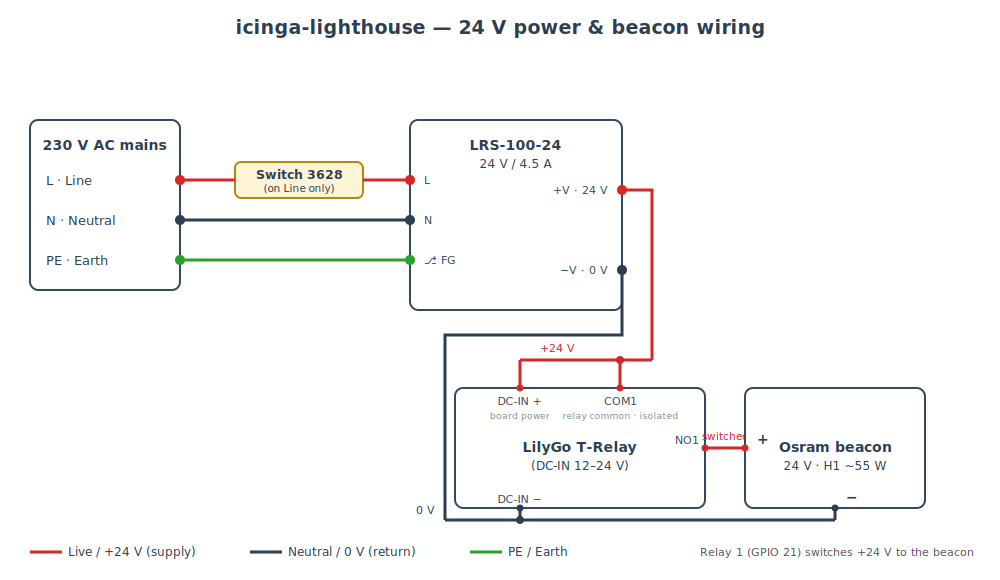

# icinga-lighthouse — Power & Beacon Wiring

Wiring for driving an **Osram rotating beacon** from the **LilyGo T-Relay** (ESP32),
powered by a single **24 V** supply, with a mains ON/OFF switch ahead of the PSU.

> ⚠️ **Mains voltage (230 V AC) is lethal.** Build inside a closed, earthed enclosure,
> fit a fuse, and have the AC side wired/checked by a qualified person. Never work on
> the circuit while it is plugged in.

---

## Bill of materials

| Qty | Component | Specification / notes |
| :-: | :--- | :--- |
| 1 | **Power supply** | Mean Well **LRS-100-24** — 24 V DC, 4.5 A (108 W), 85–264 V AC input |
| 1 | **Controller** | LilyGo **T-Relay** (ESP32, 4-channel), **DC-IN 12–24 V** |
| 1 | **Beacon** | Osram rotating beacon, **24 V**, **H1** halogen (~55 W ≈ **2.3 A** @ 24 V) |
| 1 | **Mains switch** | Type **3628**, AC-rated (≥ 250 V, ≥ 6 A) — fitted **on the Line conductor** |
| 1 | **Fuse** | T2A slow-blow on the Line, before the PSU *(recommended)* |
| 1 | **Enclosure** | Metal, bonded to **PE** (protective earth) |
| — | **Wiring** | Mains: ≥ 0.75 mm²; 24 V beacon leg: sized for beacon current |

The siren/beacon is driven by **Relay 1** of the T-Relay (GPIO 21). The board itself is
powered from the **same 24 V rail** via its 12–24 V DC input — no DC-DC converter needed.

---

## Wiring diagram

**Legend** — 🔴 red = Live / +24 V (supply) · ⬛ dark = Neutral / 0 V (return) · 🟢 green = PE (earth).
Relay 1 (GPIO 21) switches +24 V to the beacon; the board is powered from the same 24 V rail.

---

## Connection table (terminal → terminal)

| # | From | To | Conductor |
| :-: | :--- | :--- | :--- |
| 1 | Mains **L (Line)** | **Switch 3628** — in | L |
| 2 | **Switch 3628** — out | LRS-100-24 **L** | **L — the switch lives here** |
| 3 | Mains **N (Neutral)** | LRS-100-24 **N** | N |
| 4 | Mains **PE ⏚** | LRS-100-24 **⏚ (FG)** + metal enclosure | Protective earth |
| 5 | LRS-100-24 **+V** (24 V) | **+24 V rail** | DC |
| 6 | LRS-100-24 **−V** (0 V) | **0 V rail** | DC |
| 7 | **+24 V rail** | T-Relay **DC-IN +** (12–24 V terminal) | Board supply |
| 8 | **0 V rail** | T-Relay **DC-IN −** | Board supply |
| 9 | **+24 V rail** | T-Relay **COM1** (Relay 1 common) | DC |
| 10 | T-Relay **NO1** (Relay 1 normally-open) | Beacon **(+)** | DC, switched |
| 11 | Beacon **(−)** | **0 V rail** | DC |

---

## How it works

The ESP32 firmware energises **Relay 1** (GPIO 21) when an unhandled Icinga problem is
confirmed. The relay's **NO1** contact then closes onto **COM1**, passing **+24 V** to the
beacon's positive lead; the beacon's negative lead is permanently tied to **0 V**, so the
beacon lights/rotates. The controller stays powered the whole time from the same 24 V rail.

Relay 1 switches the **positive (+24 V)** leg; the **0 V** leg is common to the PSU, the
board's DC-IN(−) and the beacon return.

---

## Design notes

1. **Switch on the Line.** The 3628 switch must interrupt **L (Line)**, between mains L and
   the PSU's L terminal (rows 1–2) — never Neutral. A double-pole switch breaking both L and
   N is even better.
2. **Single common 0 V.** PSU `−V`, T-Relay `DC-IN(−)` and the beacon `(−)` all share the
   0 V rail. Relay contacts are isolated from the logic, but the supply ground is common.
3. **Verify the “12–24 V” marking** is on the board's **DC power input** terminal before
   connecting — feeding 24 V to a 5 V-only input would destroy the board.
4. **Halogen inrush.** An H1 bulb's cold filament draws ~8–10× its rated current (~20 A for a
   few ms). The on-board relay contacts (typ. 10 A / 30 V DC) tolerate this occasionally; for
   frequent switching add an external power relay/contactor or an NTC soft-start to spare the
   contacts.
5. **Fuse + earth.** Fit a T2A slow-blow fuse on L before the PSU, and bond the metal
   enclosure to PE.
6. **Supply headroom.** Beacon ~2.3 A + board < 0.2 A ≈ 2.5 A, well within the LRS-100-24's
   4.5 A.

---

## Variants

- **12 V beacon** → use a **LRS-100-12** instead; everything else is identical.
- **230 V AC beacon** → the beacon hangs directly on 230 V switched by Relay 1 (rated
  10 A / 250 V AC). The control side still needs its own 5–24 V supply for the board, and the
  relay contact then carries mains — keep that wiring isolated and fused accordingly.
